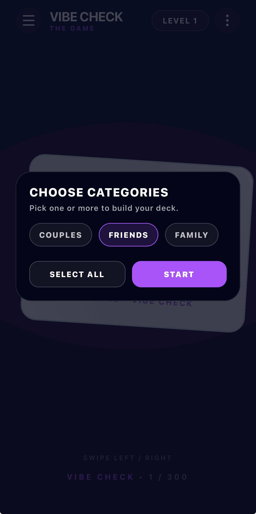
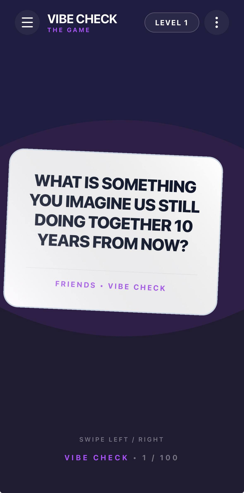

# Connection Cards

A mobile card game app designed to spark meaningful conversations between couples, friends, and family. Built with React Native and Expo.

## Screenshots

| Preview 1 | Preview 2 |
|:---------:|:---------:|
|  |  |

## Features

- Three conversation categories: Couples, Friends, and Family
- 100 thoughtfully crafted questions per category
- Swipeable card interface
- Clean, minimal design

## Tech Stack

- React Native
- Expo (SDK 54)
- Expo Router (file-based routing)
- React Native Reanimated
- TypeScript

## Getting Started

### Prerequisites

- Node.js (v18 or later)
- npm
- Expo Go app on your phone (optional, for testing on a physical device)

### Installation

1. Clone the repository:

```bash
git clone https://github.com/your-username/connection-cards.git
cd connection-cards
```

2. Install dependencies:

```bash
npm install
```

3. Start the development server:

```bash
npx expo start
```

4. Open the app:
   - Scan the QR code with the Expo Go app on your phone
   - Press `w` to open in a web browser
   - Press `a` to open in an Android emulator
   - Press `i` to open in an iOS simulator

## Project Structure

```
card-game/
  app/            - App screens and routing
  assets/         - Images and static files
  components/     - Reusable UI components
  constants/      - App-wide constants
  hooks/          - Custom React hooks
  services/       - API and service logic
  questions.json  - Question data for all categories
```

## License

This project is for personal use only.
